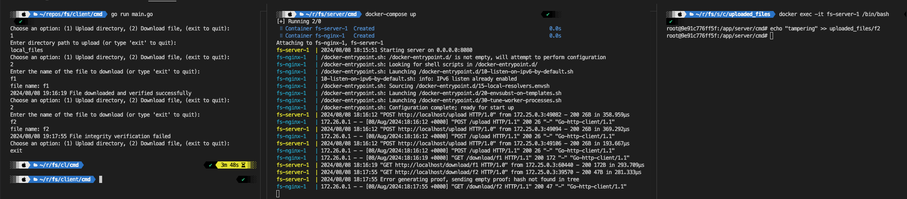

# File System with Merkle Proof Verification

### Project Description

This project implements a file system where clients can upload directories containing files to a server, and later download and verify these files using a Merkle tree for integrity checks. The system ensures that files are not tampered with during storage or transmission.

### Client Application

The client application provides an interactive CLI for uploading directories and downloading files.

#### Upload Directory

1. The files to be uploaded are located in `./client/cmd/local_files`.
2. The client will upload all files in the directory to the server and delete the local copies.
3. The client will compute a Merkle tree root hash and save it to `merkle_root.txt`.

#### Download File

1. Enter the name of the file to download.
2. The client will download the file and the Merkle proof from the server.
3. The client will verify the file integrity using the Merkle proof and the root hash stored in `merkle_root.txt`.

### Server Application

The server handles file uploads and downloads.

#### Upload Endpoint

- **URL**: `/upload`
- **Method**: `POST`
- **Description**: Accepts file uploads and updates the Merkle tree with the file hash.

#### Download Endpoint

- **URL**: `/download/{fileName}`
- **Method**: `GET`
- **Description**: Provides the requested file and its Merkle proof.

### Nginx as a Reverse Proxy

Nginx is configured as a reverse proxy to handle client requests securely and efficiently.

- **Configuration**: The Nginx configuration is located in the `nginx/nginx.conf` file.
- **HTTPS**: Nginx is set up with a self-signed certificate for dev environment HTTPS communication.
- **Proxying**: Nginx forwards incoming client requests to the backend Go server, ensuring that clients cannot access the server directly.

### How to Run

#### Prerequisites

- Go 1.18 or later
- Docker
- Docker Compose

#### Steps

After cloning the repo open a terminal on its root and:

**Launch the docker-compose containing the nginx and server containers**

```sh
docker-compose up
```

Then open a separate terminal on the repo root and:

**Run the client application**

```sh
cd client/cmd
go run main.go
```

After having both the server and client running, interact with the CLI on the client terminal to :

1. Upload the `local_files` directory, containing the files `f1`, `f2` and `f3`.
2. Succsessfully download and verify the `f1` file from the server.
3. On a separate terminal, log into the server container to tamper with the `f2` file.
4. Back on the CLI ,download the `f2` file and verify that we can't compute the original merkle tree root hash with the returned proof.


